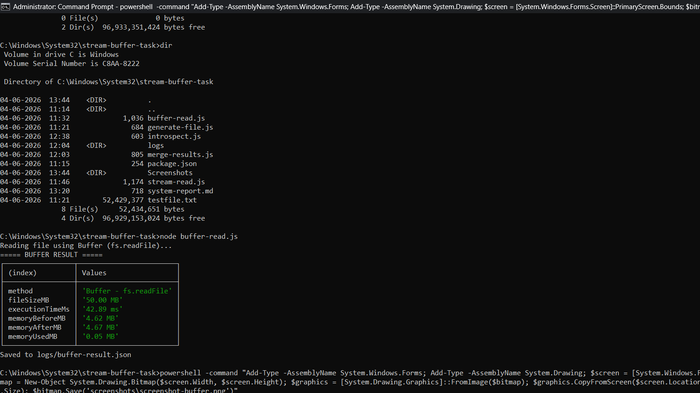
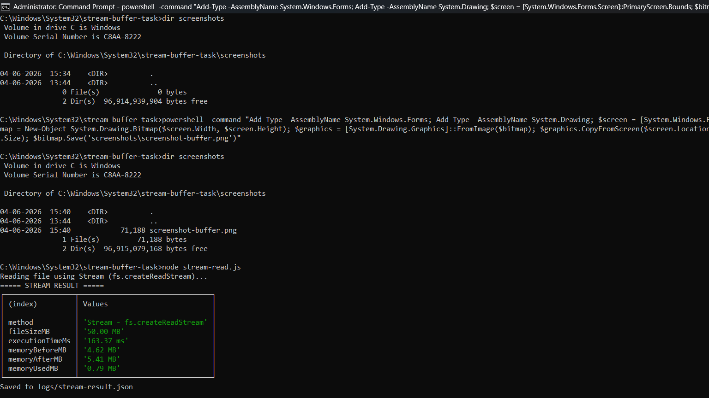
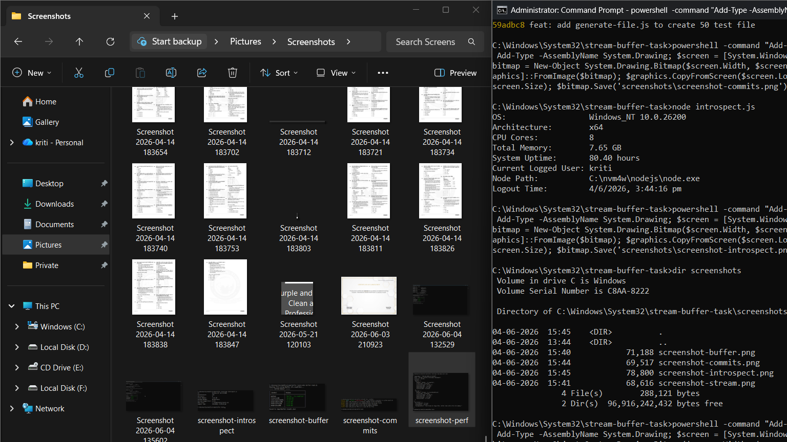
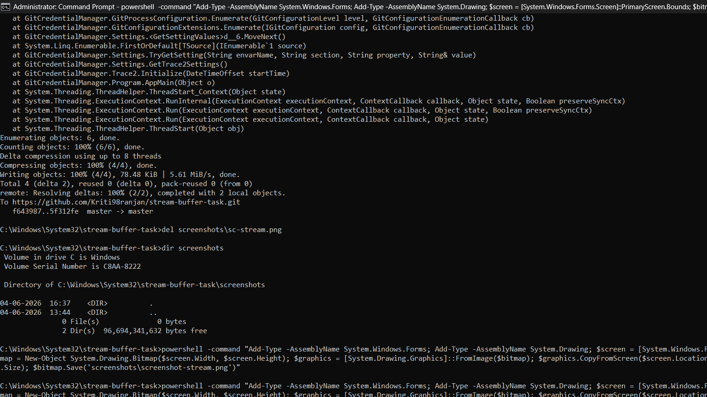
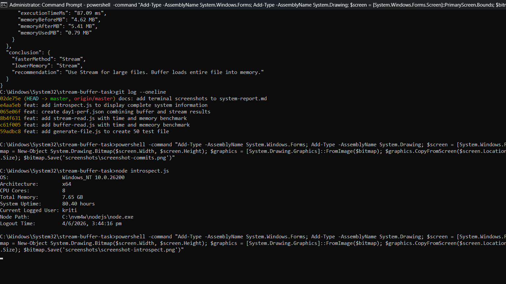

# System Performance Report 
 
## 1. Buffer Result 
 
 
## 2. Stream Result 
 
 
## 3. day1-perf.json Output 
 
 
## 4. Git Commits 
 
 
## 5. Introspect Output 
 
 
## Conclusion 
 
### Buffer vs Stream Comparison 
- Buffer loads entire file into RAM at once 
- Buffer Execution Time : 43.61ms 
- Buffer Memory Used    : 0.05MB 
- Stream reads file in small chunks 
- Stream Execution Time : 85.08ms 
- Stream Memory Used    : 0.081MB 
 
